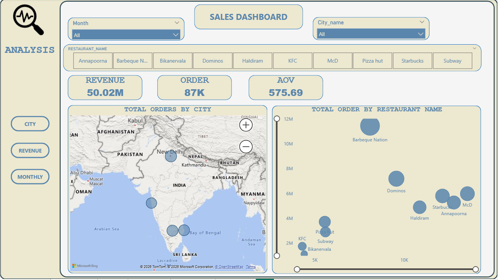
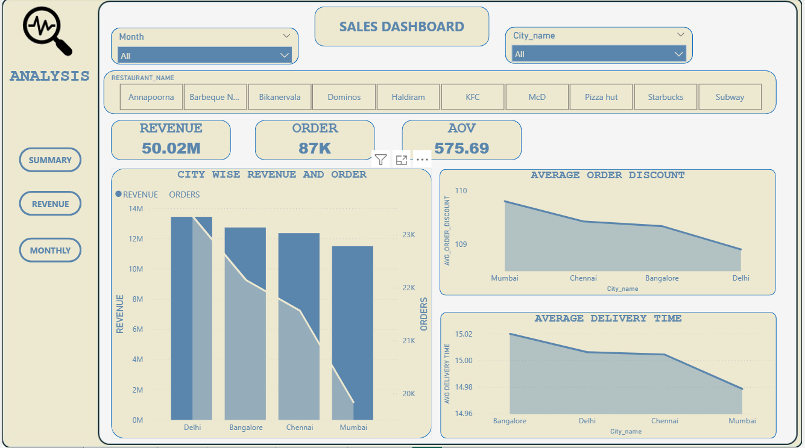
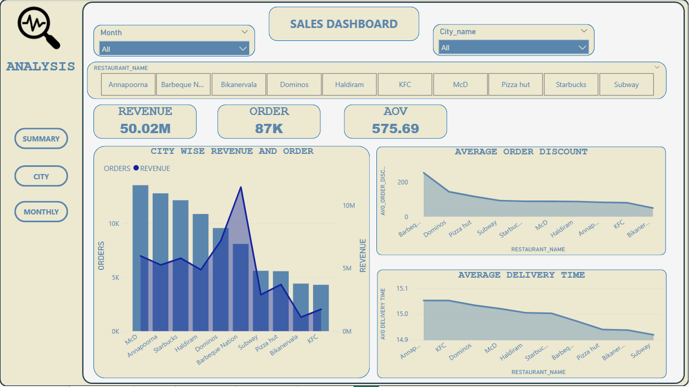
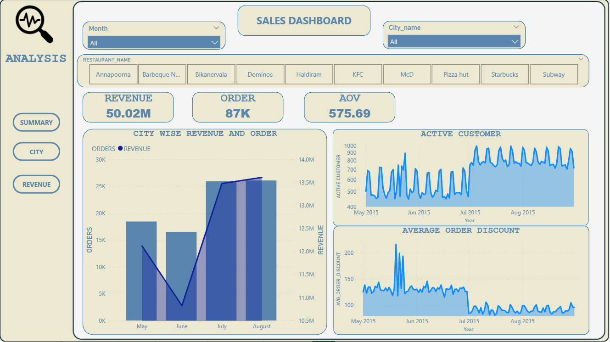

# 🍽️ Restaurant Sales Dashboard

## 📌 Project Overview

The Restaurant Sales Dashboard is an interactive Power BI report designed to analyze restaurant performance across cities, revenue trends, and customer ordering behavior.

This dashboard helps business stakeholders monitor revenue, track total orders, compare restaurant performance, and identify high-performing cities.

## 🎯 Business Problem

Restaurant chains operating in multiple cities need clear insights into:

Which restaurants generate the highest revenue

Which cities drive maximum orders

Monthly sales trends

Average Order Value (AOV) performance

Location-based demand patterns

Without centralized reporting, strategic decisions become slow and inefficient.

## 📊 Key Metrics

💰 Total Revenue: 50.02M

📦 Total Orders: 87K

🧾 Average Order Value (AOV): 575.69

## 📈 Dashboard Features
  ## 🔹 City-Level Analysis

Interactive map showing total orders by city

Geographic performance comparison

  ## 🔹 Restaurant Performance

Total orders by restaurant name

Performance comparison using bubble chart

  ## 🔹 KPI Cards

Revenue

Total Orders

AOV

  ## 🔹 Dynamic Filters

Month

City Name

Restaurant Name

## 🏆 Key Insights

Barbeque Nation shows highest order volume

Dominos and McD are strong mid-tier performers

Orders are concentrated in major metropolitan cities

AOV indicates strong customer spending behavior

## 🛠 Tools & Technologies

Power BI

DAX

Data Modeling

Data Cleaning

Bing Maps Integration

## 📌 Project Outcome

 ## This dashboard enables:

Better city-level expansion planning

Restaurant performance benchmarking

Revenue optimization strategies

Data-driven decision-making

## 📊 Dashboard Preview

 ## SUMMARY

 ## CITY
 

 ## REVENUE
 

 ## MONTHLY
 
